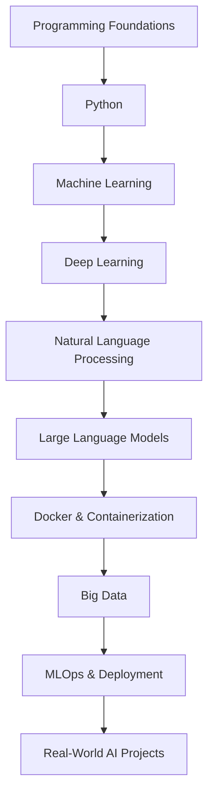

# 🚀 Softito — AI Engineering Bootcamp Portfolio
Hands-on implementations, projects, and learning materials covering AI engineering from fundamentals to deployment.

[](https://github.com/mihrinurilunt/softito) []() []() []() []()

> A polished, portfolio-grade collection of hands-on modules: reproducible notebooks, production-minded demos, and compact projects that teach AI engineering by building.

---

## Quick navigation
- 📁 Repository structure — see below  
- 🧭 Learning roadmap — conceptual flow (Mermaid)  
- 🔬 Featured work — LLM, CV, Big Data, deployments  
- 🛠️ Tech stack — badges & examples  
- 📦 Mini projects & outcomes — ready-to-run exercises

---

## Learning Journey (Roadmap)


---

## Repository Structure
```text
Softito/
│
├── Python/
├── Machine-Learning/
├── Deep-Learning/
├── NLP/
├── LLM/                    # ai_codes/llm — end-to-end LLM engineering
├── Docker/
├── Big-Data/
├── Projects/               # Mini projects & capstones
├── deployments/            # FastAPI, Docker Compose, Kubernetes examples
├── docs/
└── README.md
```

---

## Repository Overview
| Folder | Description | Main Technologies | Status |
|---|---|---|---:|
| Python | Utilities, scripting, foundations | Python, venv, pytest | ✅ Ready |
| Machine-Learning | Classic ML pipelines & experiments | scikit-learn, Pandas | ✅ Ready |
| Deep-Learning | CNNs, transfer learning, vision models | PyTorch, TensorFlow, OpenCV | ✅ Ready |
| NLP | Tokenization, embeddings, text pipelines | NLTK, spaCy, TF-IDF | ✅ Ready |
| LLM | Transformer internals to serving | Transformers, HF, PEFT, BitsAndBytes | 🔧 Active |
| Docker | Containerization examples & patterns | Docker, Compose | ✅ Ready |
| Big-Data | Spark jobs, ETL, streaming demos | PySpark, Hadoop, Spark SQL | 🔧 Active |
| Projects | End-to-end mini projects | Mixed stack (above) | ✅ Mixed |

---

> 💡 Quick note: each folder pairs a short conceptual README with runnable notebooks, concise production notes, and a reproducible environment (requirements or docker).

---

## Technologies (selected)
   

   

   

   

   

---

## What you will find
- Practical coding exercises and reproducible notebooks  
- End-to-end mini projects using public datasets  
- Production-inspired implementations (FastAPI, Docker)  
- Visual explanations and compact diagrams  
- Clean, modular code and reusable utilities  
- Well-documented READMEs per module

---

## Featured Learning Areas

### Machine Learning
- Classification • Regression • Clustering  
- Feature engineering • Model evaluation & pipelines

### Deep Learning
- CNNs • Transfer learning • YOLO • Image segmentation • OCR (CRNN)

### Natural Language Processing
- Text preprocessing • Tokenization • TF–IDF • Word embeddings  
- Sentiment analysis • Text classification

### Large Language Models (LLMs)
- Transformer internals • Attention • Tokenization  
- PEFT • LoRA • Quantization (BitsAndBytes)  
- RLHF • DPO • Evaluation • Serving • Security

### Docker & Deployment
- Dockerfile • Docker Compose • Multi-container apps  
- FastAPI deployment patterns • Volumes & env management

### Big Data
- Hadoop & MapReduce concepts • PySpark • Spark SQL • MLlib  
- Structured streaming • ETL pipelines

---

## Mini Projects (examples)
- Image classification with transfer learning  
- Object detection (YOLO) demo  
- OCR pipeline & document processing  
- Spark analytics & ETL mini-pipelines  
- LLM experiments: small-model training, PEFT, quantization, serving

---

## Repository Philosophy
> Learn by Building  
Each concept is validated with a compact implementation and a small experiment. The goal is practical engineering knowledge—design, implement, test, and document.

---

## Learning Outcomes (practical checklist)
- [ ] Data preprocessing and feature engineering  
- [ ] Machine learning workflows (training → eval → deploy)  
- [ ] Deep learning architectures and transfer learning  
- [ ] Computer vision pipelines (detection, OCR)  
- [ ] NLP pipelines and embedding use  
- [ ] LLM fundamentals, fine-tuning, and quantization  
- [ ] Containerization and deployment best practices  
- [ ] Big Data processing with Spark  
- [ ] Production-ready code structure and docs

---

## Future Roadmap (planned)
- [ ] RAG systems & retrieval pipelines  
- [ ] Vector DBs (FAISS, Milvus, Weaviate)  
- [ ] AI agents & LangChain / LangGraph experiments  
- [ ] MCP and governance artifacts (model cards)  
- [ ] Multi-agent systems & orchestration  
- [ ] Kubernetes + CI/CD for model deployment  
- [ ] Monitoring, observability, and model governance  
- [ ] Cloud deployment examples (AWS, Azure)

---

## Repository Statistics (high-level)
- Learning modules: XX+  
- Mini projects: XX+  
- Technologies explored: XX+  
- Practical implementations: XX+  
- Documentation coverage: High (module-level READMEs & notebooks)

---

## How to get started
<details>
<summary>Quick start — local</summary>

1. git clone https://github.com/mihrinurilunt/softito.git  
2. cd softito/<folder-of-interest> (e.g., ai_codes/llm)  
3. python -m venv .venv && source .venv/bin/activate  
4. pip install -r requirements.txt (or see folder-specific env)  
5. Open Jupyter notebooks or follow README in each module

</details>

---

## Contributing
- Small, focused PRs welcome (feature / bugfix / doc)  
- Follow folder README conventions (purpose, run steps, tech)  
- I can add a CONTRIBUTING.md with commit & review guidelines on request

---

## References & further reading
<details>
<summary>Selected papers & docs</summary>

- Vaswani et al., "Attention Is All You Need"  
- Hugging Face docs — transformers & PEFT guides  
- PyTorch & TensorFlow official docs  
- Apache Spark documentation

</details>

---

If you want, I will:
- Commit this README to the repo root (main branch), or  
- Generate a matching CONTRIBUTING.md and a minimal requirements.txt / Dockerfile per top modules.
